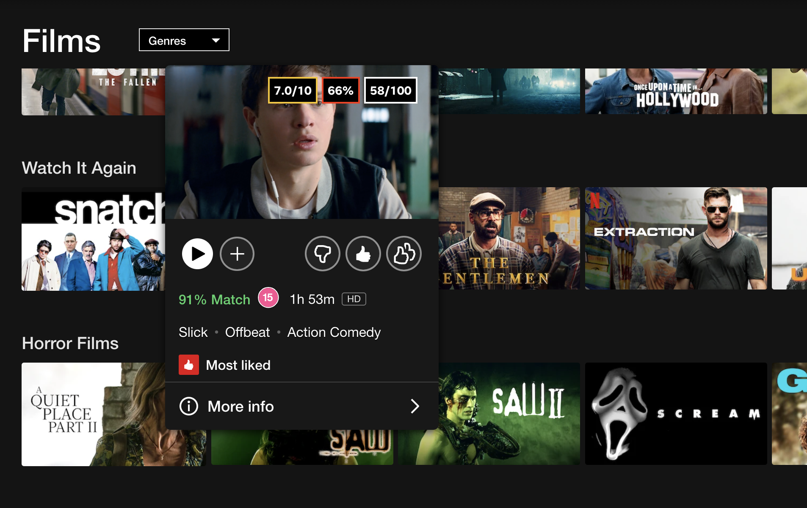
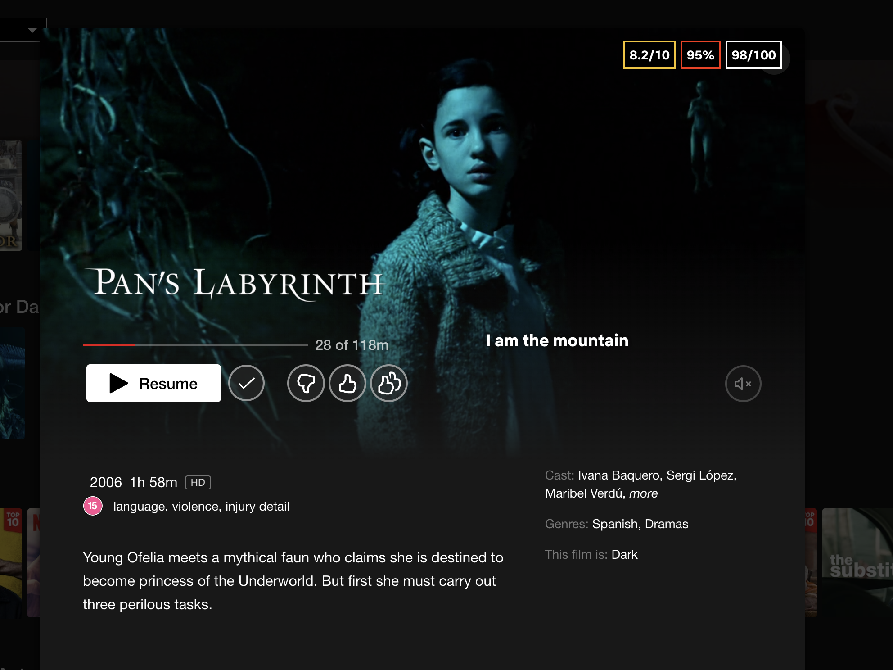

# Netflix-Ratings

The 'Netlfix Ratings' Chrome Extension allows Netflix to display IMDB, Rotten Tomatoes and Metacritic ratings when hovering over movie/show thumbnails.

IMDB ratings are outlined in Yellow. 
Rotten Tomatoes ratings are outlined in Red. 
Metacritic ratings are outlined in White.

The extension utilises the OMDb API. Therefore, to be able to use the extension once cloning the project, you will need to obtain an API key from OMDb.  
You will be able to generate an OMDb API key here: https://www.omdbapi.com/apikey.aspx

Once the OMDb API key has been created, you will need to assign this to the API_KEY variable within the contentScript.js file.
